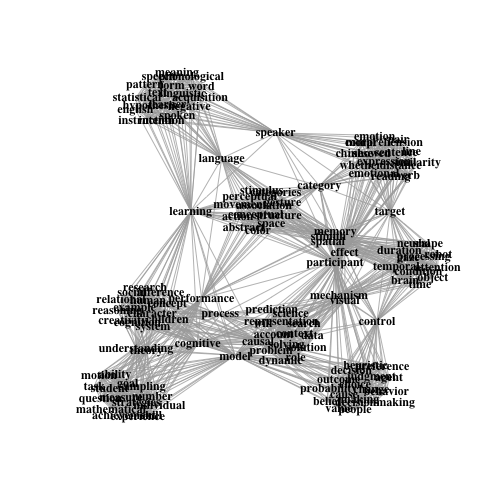

```r

### programmed by http://github.com/racdale, 8/7/2014 ###

library(lda)  # latent dirichlet methods
```

```
## Warning: package 'lda' was built under R version 3.0.2
```

```r
library(tm)  # some nlp methods
```

```
## Warning: package 'tm' was built under R version 3.0.2
```

```r
library(igraph)  # networks
```

```
## Warning: package 'igraph' was built under R version 3.0.2
```

```r
library(RWeka)  # stemming et al.
```

```
## Warning: package 'RWeka' was built under R version 3.0.2
```

```r
library(SnowballC)  # stemming
```

```
## Warning: package 'SnowballC' was built under R version 3.0.2
```

```r

setwd("/Users/rickdale/Dropbox/scrapePCS/scrapePCS/cogsci2014/lda_display")
```

```
## Error: cannot change working directory
```

```r
a = read.table("abstracts.txt", sep = "\n", quote = "")
colnames(a) = list("abs")
a$abs = as.character(a$abs)

abs = a$abs

### let's clean ### stemit = function(x) { # stemmers aren't pretty mostly
### news = LovinsStemmer(unlist(strsplit(x,split=' ')),control=NULL)
### return(paste(news,collapse=' ')) } abs = lapply(abs, stemit)
ts = Corpus(VectorSource(abs))  # using tm to strip / clean
ts = tm_map(ts, removeWords, stopwords("english"))
removepunct = function(x) {
    return(gsub("[[:punct:]]", "", x))
}
ts = tm_map(ts, removepunct)
removenum = function(x) {
    return(gsub("[0-9]", "", x))
}
ts = tm_map(ts, removenum)
doublespace = function(x) {
    return(gsub("  ", " ", x))
}
ts = tm_map(ts, doublespace)

abs = PlainTextDocument(ts)  # make it plain

chunk = paste(abs, collapse = " ")  # cheap plural removal
words = unique(unlist(strsplit(doublespace(chunk), split = " ")))
pukeplural = function(x) {
    return(gsub(search_term, allstring_minus_last, x))
}
for (w in words) {
    search_term <- w
    lastletter <- substr(w, nchar(w), nchar(w))
    allstring_minus_last <- substr(w, 1, nchar(w) - 1)
    if (lastletter == "s" & allstring_minus_last %in% words & nchar(w) > 3) {
        abs = lapply(abs, pukeplural)
    }
}

corpus = lexicalize(abs)  # yup
to.keep = corpus$vocab[word.counts(corpus$documents, corpus$vocab) >= 3]  # only stuff that happens, actually
to.keep = to.keep[to.keep != "" & nchar(to.keep) > 3]  # no short words, or empties
corpus = lexicalize(abs, vocab = to.keep)
result = lda.collapsed.gibbs.sampler(corpus, nclusts <- 8, to.keep, 25, 0.1, 
    0.1)  # out of the box run
top.words = top.topic.words(result$topics, nwords <- 20, by.score = TRUE)  # out of the box run
edges = data.frame()  # let's build the edges for our igraph plot
for (i in 1:nclusts) {
    edges = rbind(edges, expand.grid(top.words[, i], top.words[, i]))  # cartesian
}
edges[, 1] = as.character(edges[, 1])
edges[, 2] = as.character(edges[, 2])
alphabetorder = function(x) {
    s = edges[x, ]
    edges[x, ] <<- edges[x, order(s)]
}
holder = sapply(1:dim(edges)[1], alphabetorder)
edges = unique(edges)
edges = edges[edges[, 1] != edges[, 2], ]
net = graph.data.frame(edges, directed = F)
plot(net, vertex.shape = "none", vertex.size = 0, vertex.color = "white", layout = layout.auto, 
    vertex.label.color = "black", vertex.label.cex = 1, vertex.label.family = "Times", 
    vertex.label.font = 2)
```

 


